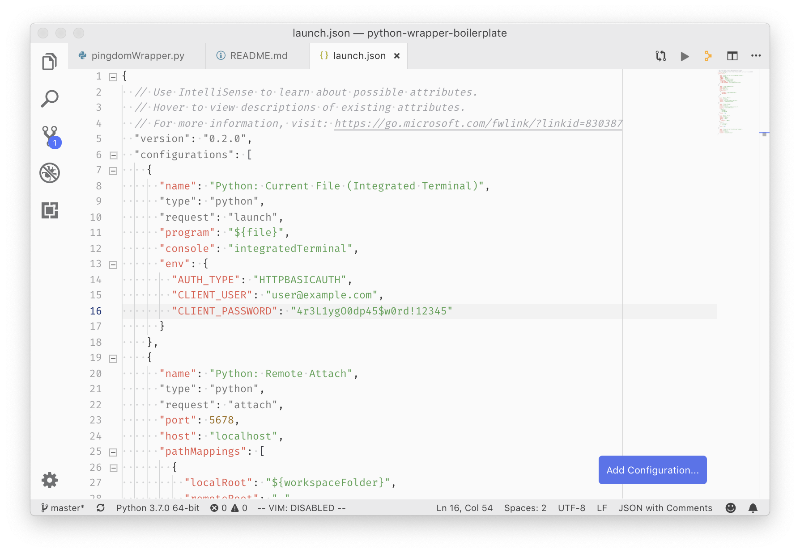

# Python Client Boilerplate

Description

By default, all responses will parsed as JSON, and will default to text if not valid JSON.

## System Requirements
- [git](https://git-scm.com/)
- [Python3](https://docs.python-guide.org/starting/installation/)
- [pip](https://pip.pypa.io/en/stable/installing/) - most likely already installed as part of Python

All of these must be available in your `PATH`. To verify things are set up properly, you can run this:

```sh
git --version
python3 --version # it's possible your python3 binary is python
pip3 --version # it's also possible your pip3 binary is pip
```

If you have trouble with any of these, learn more about the PATH environment variables and how to fix it here for [windows](https://www.howtogeek.com/118594/how-to-edit-your-system-path-for-easy-command-line-access/) or [mac/linux](http://stackoverflow.com/a/24322978/971592).

## Setup

First, clone the repo:

```sh
git clone <this repo>
cd <repo name>
```

Python is a little divided on how to manage environments. If you know what you're doing, feel free to use whatever you prefer (`pipenv`, `venv`, global `pip`, etc.).

Otherwise, run these commands:

```sh
virtualenv venv
source venv/bin/activate #or venv/bin/activate.fish
pip3 install -r requirements.txt
```

## How to use it

This is just a boilerplate client. At the very minimum, here are the steps required for creating a functional Python client:
- In exampleClient.py, change the URL near the top to match the API you are calling
- Set environment variables in whatever context will be running your code for authentication (Basic auth is most common). This could be VS Code, any other IDE, a terminal emulator, or on a hosting provider's site.

Example shell:
```sh
export AUTH_TYPE='HTTPBASICAUTH'
export CLIENT_USER='user@example.com'
export CLIENT_PASSWORD='4r3L1ygO0dp45$w0rd!12345'
```

Example VSCode:



### Simple Test

For a trivial test just to validate the client is working as expected, you can just add in a test case in the `if __name__ == "__main__":` section at the bottom. 

Any code included here will run ONLY if the `exampleClient.py` file is run directly.

It can also be helpful to set the environment variable `DEBUG=1` to get debugging output from the HTTP requests.

```py
if __name == "__main__":
  client = Example()
  users = client.make_request('/api/v1/users')
  logger.info(users)
```


### Using the client as a module

Most of the time, you'll have a program that is using this client for just calling the API and you'll have other logic held somewhere else.

Assuming this `exampleClient.py` file is in the same directory as your consuming code, you can use the following:

```py
import Example from exampleClient

client = Example() # instantiates a client object - uses environment variables for auth if present
resources = client.make_request('/api/v1/resources') # will send a GET request to the resources endpoint
users = client.get_users() # 

john = client.get_user(id="12") # returns the user object for John
```

## Roadmap

Things I'd like to include:
- Make Python2/3 compatible
- Generate a client from the boilerplate given an OpenAPI url
- HTTP_Method class in place of Strings
- Handle responses other than JSON more elegantly
- Handle rate limiting
- Handle retries on `5XX` status codes
- Implement a better non-environment-variable based configuration management system
- Create a `setup.py`

## Common Issues


If you are not using a virtual environment of any sort, the default shebang command (`/usr/bin/env python`) might default to `python2`. 

You can change this to the absolute path of your `python` binary or update it to explicitly call out `/usr/bin/env python3`.
